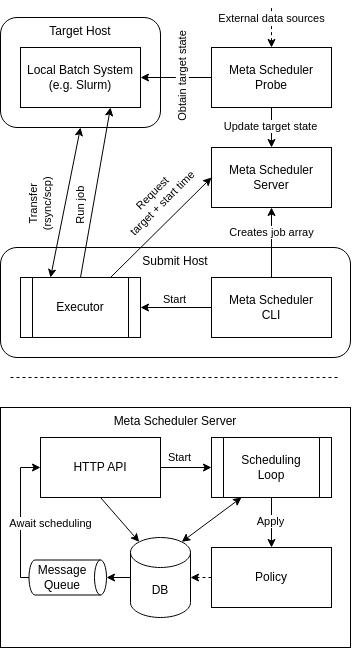
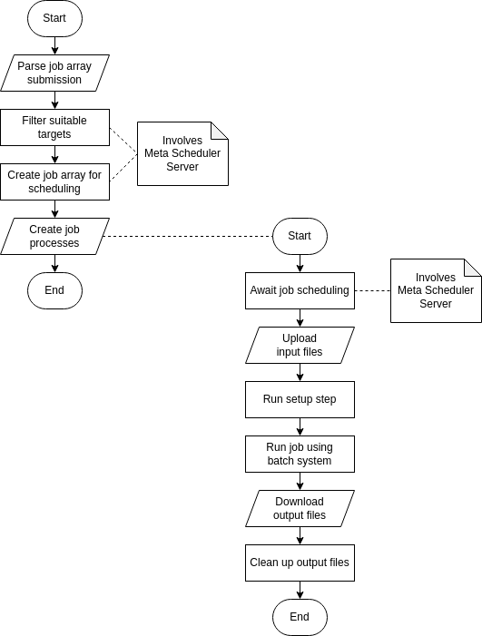

# Meta-Scheduler Documentation

## Table of Contents

- :world_map: [Overview](#overview)
- :construction: [Installation](#installation)
- :construction_worker: [Administrators](#administrators)
- :computer: [Users](#users)

## Overview

The core concepts of the Meta Scheduler are illustrated in the diagrams below:

<table><tbody style="text-align: center;">
<tr>
<td>Main components of the Meta Scheduler</td>
<td>Flowchar for job (array)</td>
<tr valign="top">
<td></td>
<td></td>
</tr>
</tbody></table>

## Installation

1. Use [direnv](https://direnv.net/) or `source .envrc` to set up the project environment and to set up [uv](https://docs.astral.sh/uv/), if it isn't already installed.
2. During development, use `mscli-dev` and `msserver-dev` to test the CLI and server respectively.
3. Build the installable Python package under `./src/<component>/dist/` using `package <all|client|server>`
4. Install the Python packages using `install <all|client|server>`. This also installs Python 3.12 (through [pyenv](https://github.com/pyenv/pyenv)) and [pipx](https://pipx.pypa.io/stable/).

## Administrators

After [installing the server package](#installation), execute it using `msserver`.  
A [default configuration file](../src/server/server/config/default.toml) is displayed, if no configuration is found at `/etc/meta-sched.toml`.
If the application is running under a non-root user and requires `sudo`, add the flag `--sudo`.

To persistently execute the server in the background after the system has booted, create a new [systemd unit](https://www.freedesktop.org/software/systemd/man/latest/systemd.service.html) or use a terminal multiplexer like [tmux](https://github.com/tmux/tmux/wiki) to manually run it in the background.

- `TODO customizing the configuration`
- `TODO implementing scheduling algorithms`

### Required Software on the Targets

- Posix shell (e.g. Bash)
- rsync or SFTP server
- SSH server
- tail, touch, mkdir, rm, date, sed (coreutils)
- xargs (findutils)
- grep
- awk
- qsub, qdel, qstat (For PBS Pro/OpenPBS)
- sbatch, scancel, squeue, sacct (For Slurm)
- module load (Optional, Environment Modules)

## Users

After [installing the client package](#installation), submit job arrays using `mscli`. 

### Folder Structure

#### Submit Host

On the submit host, all data lives in `$HOME/meta-sched/`.
For each `job spec` this directory contains a `<job spec>/input/` folder with job input files which are uploaded to the target hosts and `<job spec>/output/` folder containing the subdirectories `<array_id>_<array_idx>/` for the output of the corresponding jobs.  
:warning: Do **NOT** delete any files from the output directory before the corresponding job has been completed, in particular `.pid` (Handle to job process on the submit host), `.status` status of the job, `output` and `error` (streaming stdout/stderr output).

#### Target Host

On the target host, all data lives in `$HOME/.meta-sched/`. It mirrors the contents of the main folder on the submit host:  
For each `job spec` this directory contains a `<job spec>/input/` folder where job input files are uploaded to and `<job spec>/output/` folder containing the subdirectories `<array_id>_<array_idx>/` which are the working and output directories of the corresponding jobs.

### Configuration

Upon running the command for the first time, the default config file at `$HOME/.config/meta-sched.toml` is created.

First, run `mscli ssh-config` to create/update `~/.ssh/config.d/meta-sched` with the targets of the Meta Scheduler server.  
Then, edit this SSH configuration file (e.g. using `vim` or `nano`), providing credentials to the target systems which should be used to execute jobs. (Test this by manually connecting to target using the SSH configuration entry name.)

### Job Control

1. To create a new job spec, run `mscli create <template> <job spec>` where `template` may be `hello-<mamico|mpi|array|ls1>`. (Check the [corresponding source code folder](../src/ms_client/data/examples/jobs/).)

2. Modify the job files template instantiated at `$HOME/meta-sched/jobs/<job spec>`.

3. Submit the job array by executing `mscli submit <job spec>`

4. Use `mscli status [--all]` to display the status of submitted jobs.

5. To cancel a job that has not yet completed, use `mscli cancel <job id>`.

### Job Specifications

* TODO

